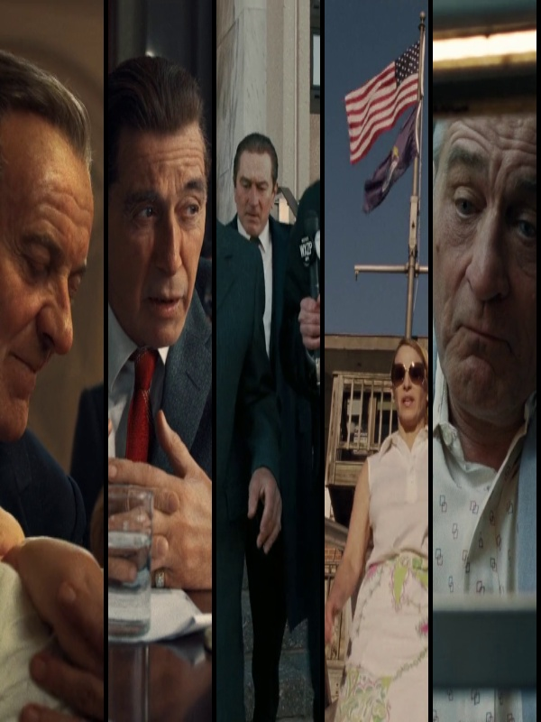

# Bars_Poster
Generate a poster composed of cropped frames from a video file

Usage: python bars.py -video URL
You can change some parameters at the beginning of the code: OUT_WIDTH, OUT_HEIGHT and number_of_cuts 

The script will cut the file according to the number of frames asked. It will present you with a first result. You can accept it or ask to change some of the frames (using index numbers of the list).

