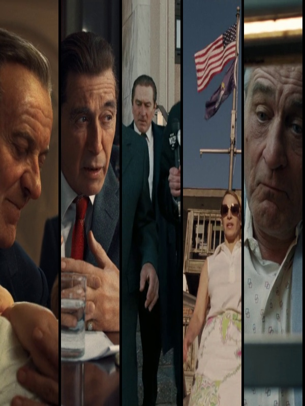
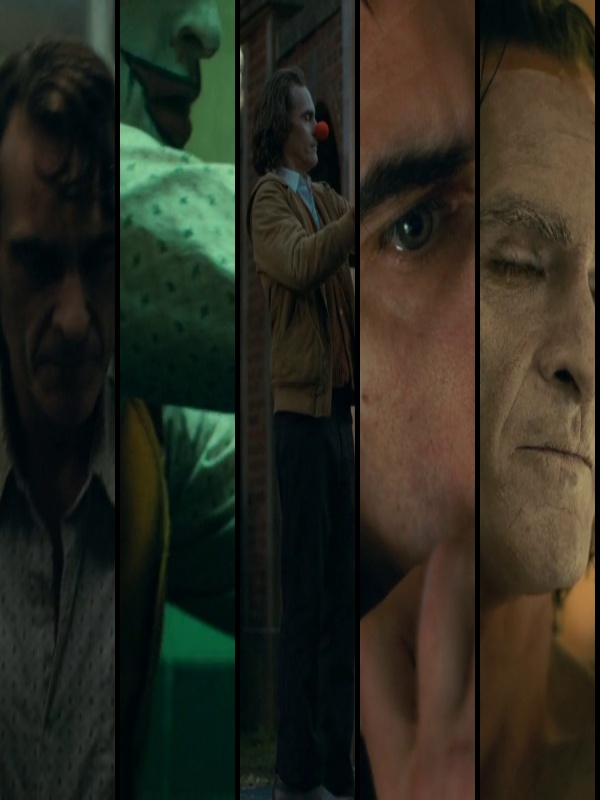

# Bars_Poster
Generate a poster composed of cropped frames from a video file

Usage: python bars_poster.py -video URL
You can change some parameters at the beginning of the code: OUT_WIDTH, OUT_HEIGHT and number_of_cuts 

